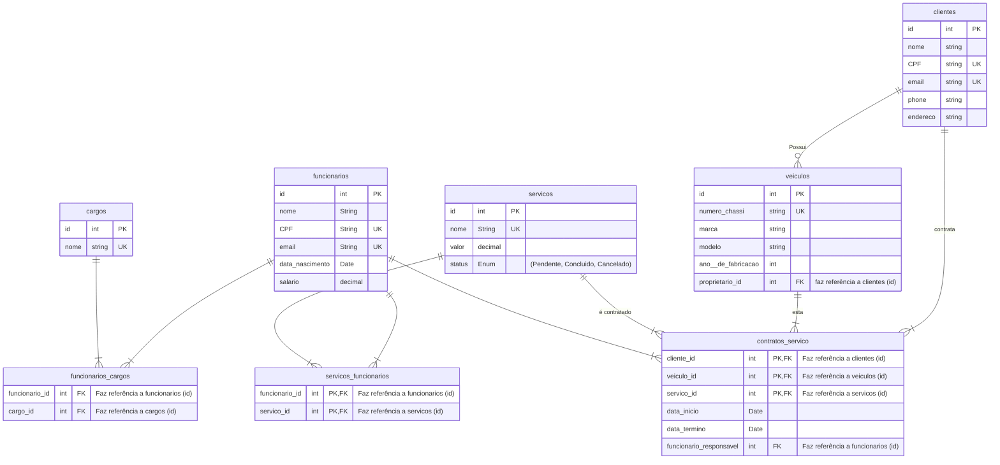

# Projeto Lógico de Banco de dados para uma oficina mecânica

# Diagrama Relacional

```mermaid
erDiagram
    veiculos {
        id int PK
        numero_chassi string UK
        marca string 
        modelo string 
        ano__de_fabricacao int 
        proprietario_id int FK "faz referência a clientes (id)"
    }
    clientes {
        id int PK 
        nome string 
        CPF string UK 
        email string UK 
        phone string 
        endereco string 
    }
    funcionarios {
        id int PK
        nome String
        CPF String UK
        email String UK
        data_nascimento Date
        salario decimal
    }
    cargos {
        id int PK
        nome string UK
    }
    servicos {
        id int PK
        nome String UK
        valor decimal
        status Enum "(Pendente, Concluido, Cancelado)"
    }

    clientes ||--o{ veiculos : Possui
    funcionarios ||--|{ funcionarios_cargos : ""
    funcionarios_cargos {
        funcionario_id int FK "Faz referência a funcionarios (id)"
        cargo_id int FK "Faz referência a cargos (id)"
    }
    cargos ||--|{ funcionarios_cargos : ""
    funcionarios ||--|{ servicos_funcionarios : ""
    servicos_funcionarios {
        funcionario_id int PK, FK "Faz referência a funcionarios (id)"
        servico_id int PK, FK "Faz referência a servicos (id)"
    }
    servicos ||--|{ servicos_funcionarios : ""

    clientes ||--|{ contratos_servico : "contrata"
    contratos_servico {
        cliente_id int PK, FK "Faz referência a clientes (id)"
        veiculo_id int PK, FK "Faz referência a veiculos (id)"
        servico_id int PK, FK "Faz referência a servicos (id)"
        data_inicio Date
        data_termino Date
        funcionario_responsavel int FK "Faz referência a funcionarios (id)"
    } 
    veiculos ||--|{ contratos_servico : "esta"
    servicos ||--|{ contratos_servico : "é contratado" 
    funcionarios ||--|{ contratos_servico : ""
```